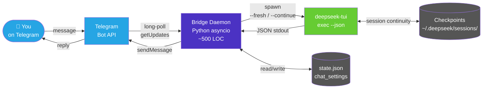
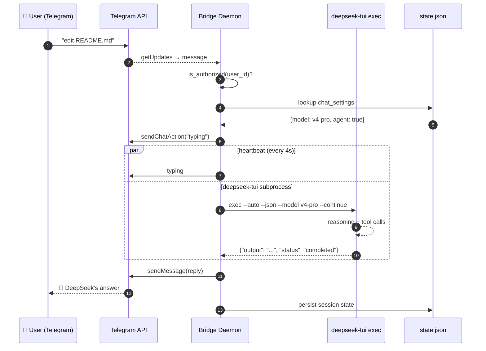
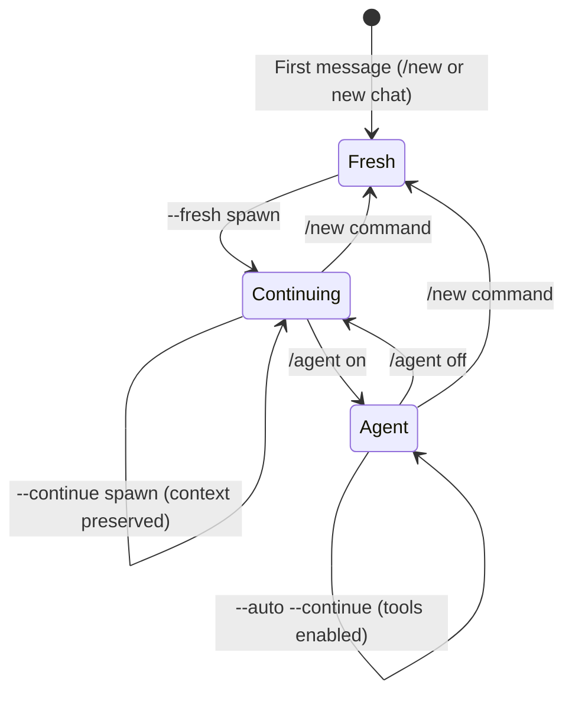
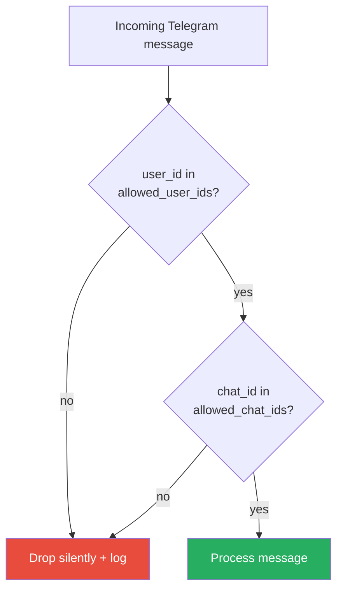

<div align="center">


# DeepSeek Telegram Bridge

### Control DeepSeek TUI from Telegram — anywhere, any device.

[](LICENSE)
[](https://www.python.org/)
[](https://github.com/Hmbown/DeepSeek-TUI)
[](https://systemd.io/)
[](https://telegram.org/)

</div>

---

## What is this?

A lightweight Python daemon that bridges your Telegram account to a locally
running **DeepSeek TUI** instance. Send messages from your phone, tablet,
or any device with Telegram — and get responses from DeepSeek TUI with
**full session continuity**, **model switching**, and optional **agent mode**
for file editing and shell commands.

```
You on Telegram          Bridge on your machine         DeepSeek TUI
     │                         │                            │
     │  "edit README.md"       │                            │
     │ ───────────────────────►│                            │
     │                         │  spawn subprocess          │
     │                         │ ──────────────────────────►│
     │                         │                            │ edits file
     │                         │ ◄──────────────────────────│
     │  "Done — updated."      │                            │
     │ ◄───────────────────────│                            │
```

## Features

| Category | Capability |
|----------|-----------|
| **Remote control** | Chat with DeepSeek TUI from Telegram on any device |
| **Session continuity** | Conversations persist across messages — pick up where you left off |
| **Agent mode** | Toggle `/agent on` to enable write, edit, shell, and git from Telegram |
| **Model switching** | `/model v4-pro` or `/model v4-flash` — switch per chat |
| **Reasoning control** | `/reasoning low|medium|high|auto` — tune thinking depth |
| **Security** | User ID allowlist, no exposed ports, systemd hardening |
| **Observability** | Typing indicators, structured logs, health-check scripts |
| **Portable** | Single-file daemon (~500 LOC Python), one dependency |

## Quick Start

```bash
# 1. Get a Telegram bot token from @BotFather and your user ID from @userinfobot
# 2. Download and install
git clone https://github.com/hah23255/deepseek-telegram-bridge.git
cd deepseek-telegram-bridge
bash scripts/install.sh

# 3. Edit config/config.json with your bot token and user ID
# 4. Start
systemctl --user start deepseek-telegram-bridge.service

# 5. Message your bot on Telegram — it replies via DeepSeek TUI
```

## Architecture



## Data Flow (per message)



## Session Lifecycle



## Telegram Commands

| Command | What it does |
|---------|-------------|
| `/start` | Welcome message |
| `/help` | Show all commands |
| `/new` | Start fresh session (forgets context) |
| `/status` | Show current session info |
| `/model v4-pro` | Switch to deepseek-v4-pro (full quality) |
| `/model v4-flash` | Switch to deepseek-v4-flash (fast, cheaper) |
| `/reasoning low` | Minimal thinking (fastest responses) |
| `/reasoning medium` | Balanced |
| `/reasoning high` | Deep reasoning for complex tasks |
| `/reasoning auto` | Default behavior |
| `/agent on` | Enable tools — write, edit, shell, git |
| `/agent off` | Disable tools — fast chat only |

## File Layout

```
deepseek-telegram-bridge/
├── src/
│   └── bridge.py                   # Main daemon (~500 LOC)
├── config/
│   └── config.example.json         # Configuration template
├── scripts/
│   ├── install.sh                  # Full setup: venv, deps, systemd unit
│   ├── install-skill.sh            # Install DeepSeek TUI management skill
│   ├── status.sh                   # Quick health check
│   └── diagnostics.sh              # 7-point system diagnostic
├── docs/
│   ├── USER_MANUAL.md              # End-user guide
│   └── API_ARCHITECTURE.md         # Internals, extension points
├── skill/
│   ├── SKILL.md                    # DeepSeek TUI skill for bridge management
│   └── references/
│       ├── bridge-architecture.md
│       └── troubleshooting.md
├── requirements.txt                # httpx[http2]
├── .gitignore
└── README.md
```

## DeepSeek TUI Skill

The pack includes a **management skill** for DeepSeek TUI. Install it to let
DeepSeek TUI manage the bridge directly:

```bash
bash scripts/install-skill.sh
```

After installation, you can ask DeepSeek TUI:
- "Check the bridge status"
- "Restart the bridge service"
- "Show me recent bridge logs"
- "Add user X to the bridge allowlist"
- "Troubleshoot why the bot isn't replying"

## Performance

| Prompt | Model | Mode | Time | Output |
|--------|-------|------|------|--------|
| "hi" | v4-flash | chat --fresh | ~16s | 72 chars |
| "test connection" | v4-flash | chat --continue | ~95s | 1374 chars |
| Complex task | v4-flash | chat --continue | ~66s | 3542 chars |

Agent mode (`/agent on`) adds 30-120s for tool execution. Use v4-flash for
fast mobile chat; switch to v4-pro for heavy analysis.

## Requirements

- **Python** 3.11+
- **deepseek-tui** v0.8.20+ (`npm install -g deepseek-tui --prefix ~/.local`)
- **httpx** with HTTP/2 support (auto-installed by `install.sh`)
- **systemd --user** (Linux) — see docs for macOS/Windows alternatives
- **Telegram bot token** from [@BotFather](https://t.me/BotFather)

## Security



- **Default-deny**: non-empty `allowed_user_ids` = only listed users
- **No exposed ports**: long-polling only, no webhook server
- **systemd hardened**: `PrivateTmp`, `ProtectSystem=strict`, `NoNewPrivileges`
- **Token secrecy**: httpx INFO logs suppressed, token never in log output
- **Single-user by design**: one bot, one chat perspective

## Comparison

| | deepseek-telegram-bridge | kimi-to-im | cc-telegram-bridge | OpenClaw |
|---|---|---|---|---|
| **Agent** | DeepSeek TUI | Kimi CLI | Codex + Claude | Multi-agent |
| **Language** | Python (~500 LOC) | Python (~1700 LOC) | TypeScript | Go + TS |
| **Session** | Native checkpoints | --print -S | /resume scan | Gateway |
| **Agent mode** | `/agent on` toggle | Always on | Per-instance | Always on |
| **Multi-bot** | Single | Single | Yes (bus) | Yes (gateway) |
| **Complexity** | Low | Low | High | Very High |

## License

MIT — see [LICENSE](LICENSE).

---

<div align="center">

**Built for one user, one host, one Telegram chat.**
**Not trying to be more than that.**

[Report an issue](https://github.com/hah23255/deepseek-telegram-bridge/issues) · [Docs](docs/) · [Discussions](https://github.com/hah23255/deepseek-telegram-bridge/discussions)

</div>
